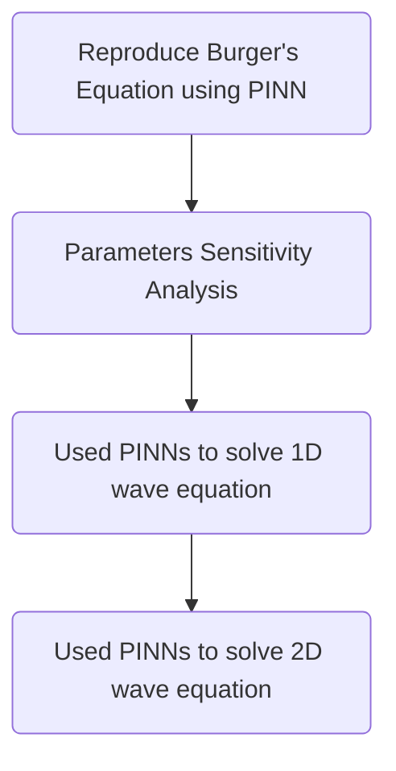

# Team_Surfers_Geoscience_Hackathon2024

##### This repository have all the resources and results used in the JSG Open Source Hackathon 2024

We reproduced the paper Raissi, M., Perdikaris, P. and Karniadakis, G.E., 2019. Physics-informed neural networks: A deep learning framework for solving forward and inverse problems involving nonlinear partial differential equations. Journal of Computational physics, 378, pp.686-707

## Brief workflow of what we reproduced and produced

