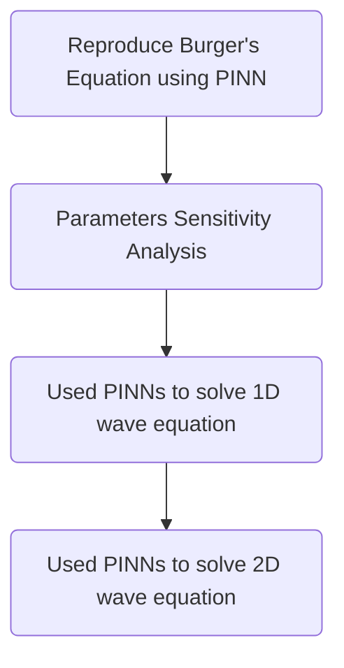

# Team_Surfers_Geoscience_Hackathon2024

##### This repository have all the resources and results used in the JSG Open Source Hackathon 2024

We reproduced the paper Raissi, M., Perdikaris, P. and Karniadakis, G.E., 2019. Physics-informed neural networks: A deep learning framework for solving forward and inverse problems involving nonlinear partial differential equations. Journal of Computational physics, 378, pp.686-707

## Brief workflow of what we reproduced and produced

## 1+1D viscous Burgers' equation:

The Burgers' equation is given by:

$$
\frac{\partial u}{\partial t} + u \frac{\partial u}{\partial x} - \nu \frac{\partial^2 u}{\partial x^2} = 0
$$

with initial and boundary conditions:

$$
u(x, 0) = -\sin(\pi x), \quad u(-1, t) = u(1, t) = 0
$$

The neural network approximation for \( u(x, t) \) is given by:

$$
NN(x, t; \theta) \approx u(x, t)
$$

### Boundary Loss

The boundary loss is defined as:

$$
L_b(\theta) = \frac{\lambda_1}{N_{b1}} \sum_{j=1}^{N_{b1}} \left( NN(x_j, 0; \theta) + \sin(\pi x_j) \right)^2
$$

$$
+ \frac{\lambda_2}{N_{b2}} \sum_{k=1}^{N_{b2}} \left( NN(-1, t_k; \theta) - 0 \right)^2
$$

$$
+ \frac{\lambda_3}{N_{b3}} \sum_{l=1}^{N_{b3}} \left( NN(1, t_l; \theta) - 0 \right)^2
$$

### Physics Loss

The physics loss is given by:

$$
L_p(\theta) = \frac{1}{N_p} \sum_{i=1}^{N_p} \left( \left( \frac{\partial NN}{\partial t} + NN \frac{\partial NN}{\partial x} - \nu \frac{\partial^2 NN}{\partial x^2} \right)(x_i, t_i; \theta) \right)^2
$$

## CPU vesrion of reproducibility

We used He normal initializer to initialize the weights to the input layer,  Activation function = tanh, L-BFGS-B = optimizer
No of iterations = 5000

